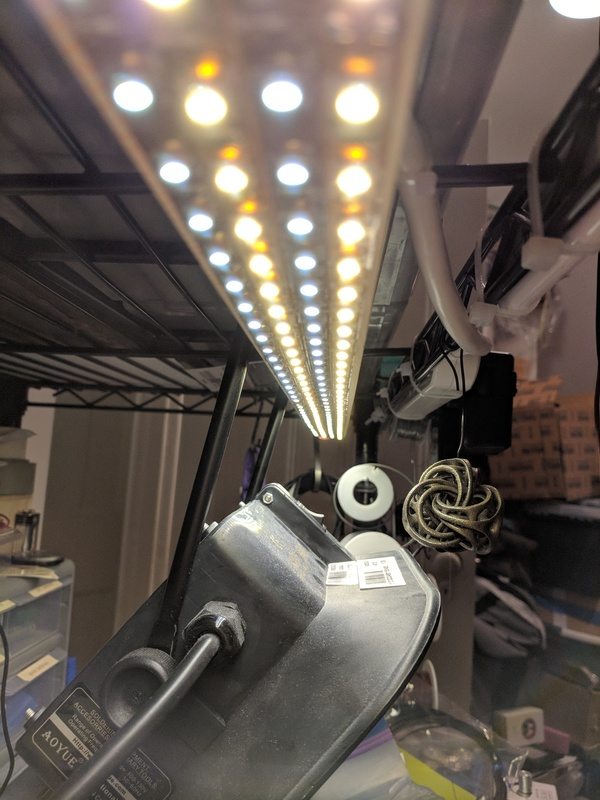

Wifi-connected Redshifting Workbench Light
==========================================

This workbench light automatically shifts from a bright, 4000K work light to a
dim 2700K as the night progresses into bedtime.

I stay up too late working on projects. While this is entirely my fault, I can
blame technology a little bit due to blueish light emanating from screens.
Using [Redshift](http://jonls.dk/redshift/) and the night mode built into
Android, I can avoid blue light from my primary screens. But I still want to
have a nice, bright workbench light and that should have some blueish light.

It can also be controlled easily from
[HomeAssistant](https://www.home-assistant.io/) too, see below.

As this is a connected device, I opted to put the part that needs to know about
the nuances of time and timezones on a server, independent of the lamp itself.
This makes it easier to modify too. This portion is a python script found in
the python directory.

Ingredients
-----------

### Hardware

* 2700K 12VDC LED strip lights
* 4000K 12VDC LED strip lights
* ESP8266 board (either the Adafruit Feather or the Sparkfun Thing)
* 5VDC (0.5A) + 12VDC (2A) power supply
* 2x MOSFETs
* Something to stick the strip lights, ESP8266, and MOSFETs to (I used a wooden ruler)

### Software
* MQTT broker (Mosquitto)
* Something with Internet access to run a Python script on
* [HomeAssistant](https://www.home-assistant.io/) (optional)

MQTT
----

First, set up an MQTT broker. This is out of scope for this README, but just
keep in mind that both the lamp and the Python script need to talk to it. I use
Mosquitto running on a private server, but a Raspberry Pi can run it just fine
too if you want.

Update `src/Secrets.h.example` and `python/mqtt_config.json.example` with the
necessary details and remove the `.example` suffix.

Electronics
-----------

Connect the MOSFETs to the PWM output pins (see the Arduino source for which
pins) and to the LED strips. Wire the power supplies to power the ESP8266 board
and the light strips.

Home Assistant
--------------

This was designed with Home Assistant in mind.
See the
[workbench_hassio_configuration.yaml](workbench_hassio_configuration.yaml)
example file. Make sure to update it with your device's ID number (a subset of
its MAC address).

